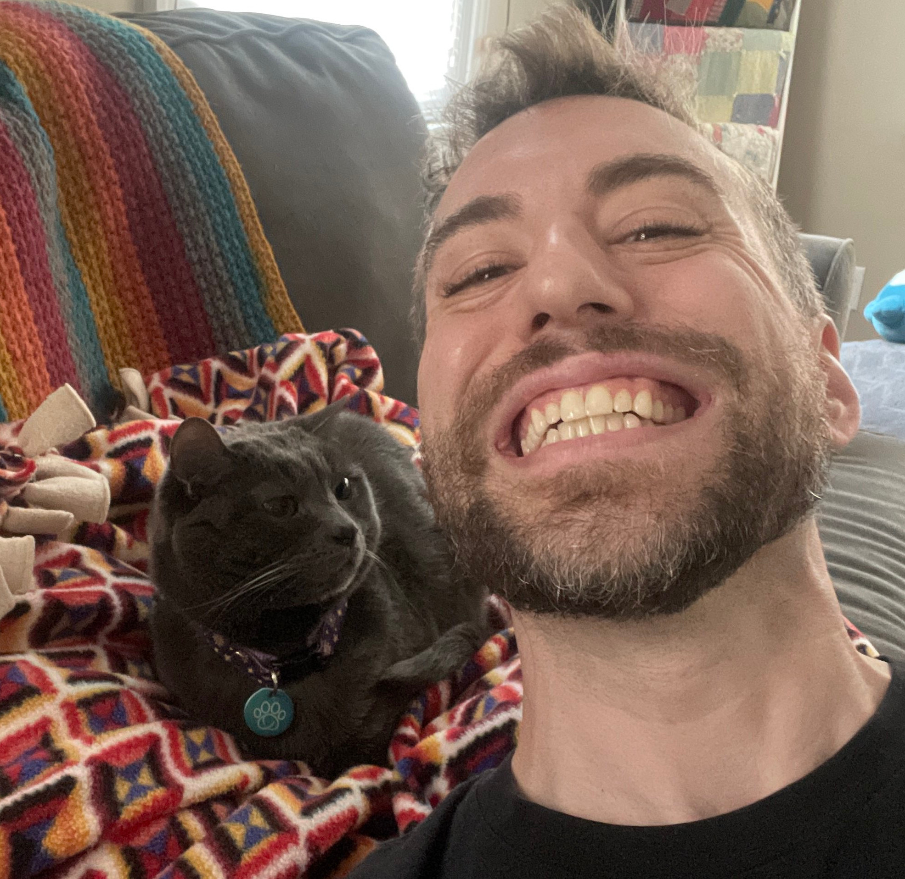

Paul Lambert. I work in tech, tinker with AI on the side, and run more servers than I probably need to.

Interested in making large language models smaller and cheaper. Open source enthusiast, longtime Arch Linux user, occasional haiku poet, Philadelphia Eagles fan.

This is where I put notes on things, so at least one of us remembers.

